# Object Detection in an Urban Environment

Udacity Self Driving Car Engineer Nanodegree 
Author: Shreyansh Shethia

## Project overview:
Self driving cars need to sense the environment around them to navigate the chassis and necessarily avoid any unsafe situations. 
Object detection can help classify different objects in the surrounding and this information is then used track the motion of these objects. This project aims to analyse the real world image data from Waymo and create a CNN model to detect certain objects in those images. The real world dataset contains images from urban enviroments with ground truth for cars, pedestrians, and cyclists already labeled. 
Firstly an extensive data analysis (EDA) is performed including the computation of label distributions, display of sample images, and checking for object occlusions. Based on EDA, the favourable augmentations are performed. Then a general pretrained CNN model is trained on the given dataset to classify pedestrians, cyclists and cars in the images. Further, the hyperparameters of trained model are modified to achieve the better results.


## Set up: 
A brief description of the steps to follow to run the code for this repository are presented here. For further details on the structure of repository, downloading the dataset is presented here [README](https://github.com/udacity/nd013-c1-vision-starter/blob/main/README.md).

1. This project was ran on a virtual deskop where the dataset and other utility files were already downloaded and installed.
2. For Exploratory Data Analysis and Exploring Data Augmentation,
    - The jupyter notebook is launched in default browser using the command: 
    
        ```
        jupyter notebook --port 3002 --ip=0.0.0.0 --allow-root
        ```
        
    - Ran ` Exploratory Data Analysis.ipynb ` for exploring the Dataset, like displaying the image and looking the class distribution.
    - Ran `Explore augmentations.ipynb` for experimenting with different data augmentations in the protos file. All augmentations are taken from [`\experiments\proto_file_dataaugmentations.txt`](https://github.com/shreyshet/Project-1-Object-Detection-in-an-Urban-Environment/blob/main/experiments/proto_file_dataaugmentations.txt)  
3. For training a pretrained model on the dataset,
    - The pretrained model [SSD Resnet 50 640x640](http://download.tensorflow.org/models/object_detection/tf2/20200711/ssd_resnet50_v1_fpn_640x640_coco17_tpu-8.tar.gz) is downloaded and moved to <path to repo>/experiments/pretrained_model/
    - The following python script is used to edit the config files for training the model 
    
      ``` python edit_config.py --train_dir <path to repo>/data/train/ --eval_dir <path to repo>/data/val/ --batch_size 2 --checkpoint <path to repo>/experiments/pretrained_model/ssd_resnet50_v1_fpn_640x640_coco17_tpu-8/checkpoint/ckpt-0 --label_map  <path to repo>/experiments/label_map.pbtxt```
      
    - The `pipeline_new.config` is moved to `<path to repo>/experiments/reference` folder
    - In the repository directory, the model is trained using 
     
     ``` python experiments/model_main_tf2.py --model_dir=experiments/reference/ --pipeline_config_path=experiments/reference/pipeline_new.config ```
     
    - Parallely, the training is visualized using 
    
    ``` python -m tensorboard.main --logdir experiments/reference/ ```
    
    - The model is evaluated using 
    
    ``` python experiments/model_main_tf2.py --model_dir=experiments/reference/ --pipeline_config_path=experiments/reference/pipeline_new.config --checkpoint_dir=experiments/reference/ ```
    
4. For further improvements on the model, the pipeline_new.config is modified with Data Augmentations, different learning rayes and different optimizers. These modifications are organized as 
```
experiments/
    - pretrained_model/
    - exporter_main_v2.py - to create an inference model
    - model_main_tf2.py - to launch training
    - reference/ - reference training with the unchanged config file
    - experiment0/ - Experiment on different Data Augmentations (DA)
    - experiment1/ - Experiment on DA and RMS prop with different learning rates  
    - experiment2/ - Experiment on DA and ADAM optimizer with different learning rates
    - label_map.pbtxt - Text file describing labels 
    ...
```
  
    Each experiment is trained similar to step 3 but in different folders, changed the ```reference``` to ```experiment0/1/2``` and config files as given in this repository.

## Dataset
1. Dataset Analysis: This section contains a quantitative and qualitative description of the dataset using `Exploratory Data Analysis.ipynb` and `Explore augmentations.ipynb`.
    - A few images from dataset using `display_images()` from `Exploratory Data Analysis.ipynb`
    
             
        *Images from datasets with bounding boxes for each class: Car (red), Pedestrian (blue) and Bicycle (green)*
    
    - The total number of ground truth labels for each class is shown using the histogram below
             
        *Class distribution*
    
    - The location and size of bounding box distribution is also plotted for each class.
    
        -      
        *Location and bounding box size distribution for Class = Car*
    
        -      
        *Location and bounding box size distribution for Class = Pedestrians*
        
        -      
        *Location and bounding box size distribution for Class = Bicycle*
    
    This shows that most of the class objects are located around horizontal centre or above of the image. This is expected as most of the locomotives are never very close to the ego-vehicle.   
    
2. Cross-validation: For cross validation the dataset was already split in the remote desktop in the ratio of 
        training: validation: test = 86: 10: 3   

## Training
1. Reference experiment: 
     - This uses the off-the-shelf pretrained model [SSD Resnet 50 640x640](https://arxiv.org/pdf/1512.02325.pdf). The modified config will changes in number of classes, batch Size, a few data augmentaions and hyperparameters for momentum optimzers.
     
     - Learning rate 
        
     
     
     - the training from tensorboard is shown below
    
    
    
     The classification loss represents error caused by misclassification of classes. The localization loss is caused by error between the position of bounding box from ground truth and model output. Regularization loss is caused by magnitude of model weights. Total loss is the sum of all three loss. 
     
    For reference model, classification loss and localization loss are almost saturated that the training is being stuck at a local minima. The regulization loss is showing an increasing trend and then a saturation, which might hint that the model is overfitted to the data. 
    
    To improve performance, the multiple changes to the config file are made. Specifically different data augmentation techiniques and optimizers are experimented. 
    
    Running the evaluation script on reference results in following image 
     
2. Experiment0: In this experiment, various data augmentation (DA) options are explored. Since these images are generated from video stream, each image will be correlated to another and model might overfit on training data. these augmentations are aimed to make these images more general and varied. 
    The [`preprocessor.proto` (https://github.com/tensorflow/models/blob/master/research/object_detection/protos/preprocessor.proto) file contains the different data augmentation method available in the Tf Object Detection API. 

- These augmentations are visualized below using: `Explore augmentations.ipynb`. 
    
    * First an example image with no DA
    
    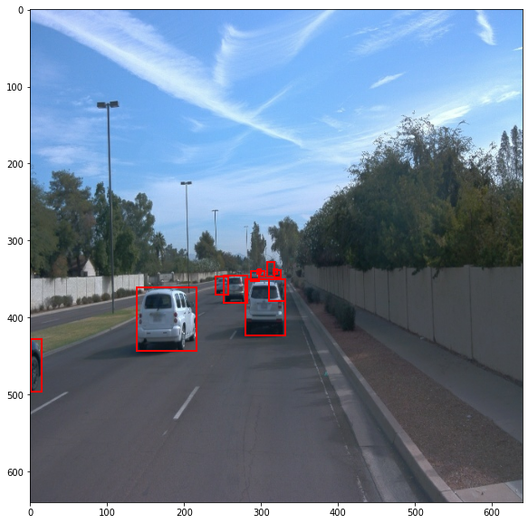
    
    * Random Horizontal Flip - this prevents the model to have bias towards objects looked from a certain angle.
    
    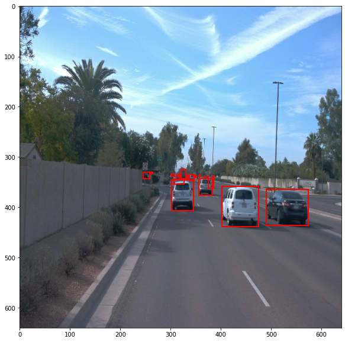
    
    * Random Pixel value scale - this is included to add noise to the images randomly within certain range.  
    
    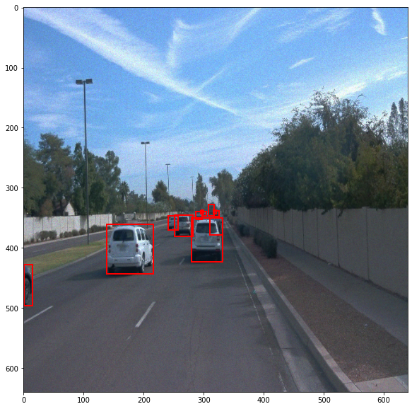
    
    * Random Adjust Brightness / Contrast / Saturation - These change the brightness, contrast and saturation randomly within certain range.  
    
    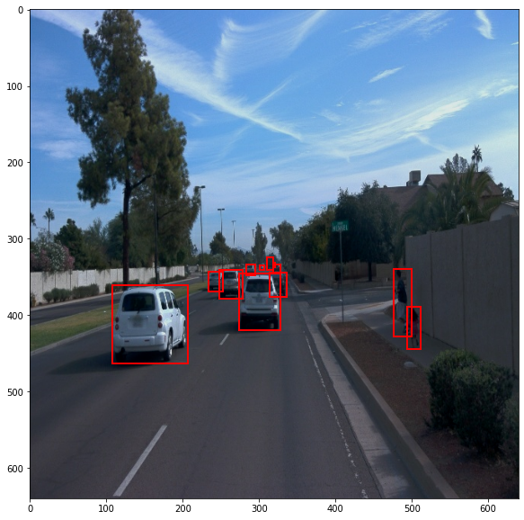
    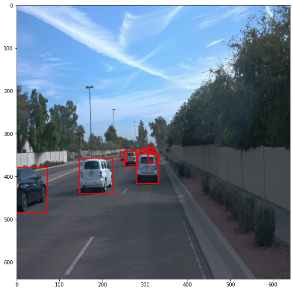
    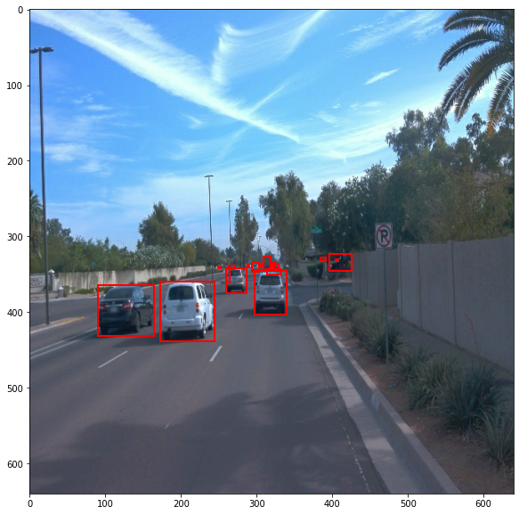
    
    * Random Black Patches - This adds random black patches of certain size onto the image.  
    
    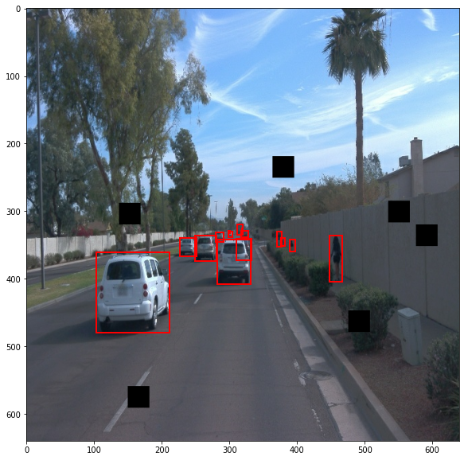
    
    * Random Crop Images - This crops and resizes the images randomly which avoids the model to train at certain parts of the image for objects
        
     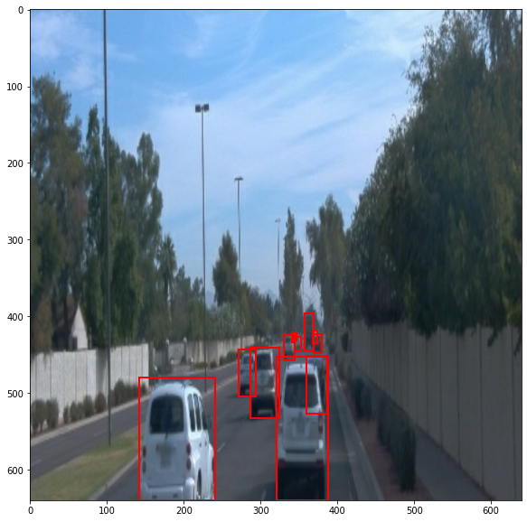
    
- Following shows the resuls from training:
    
    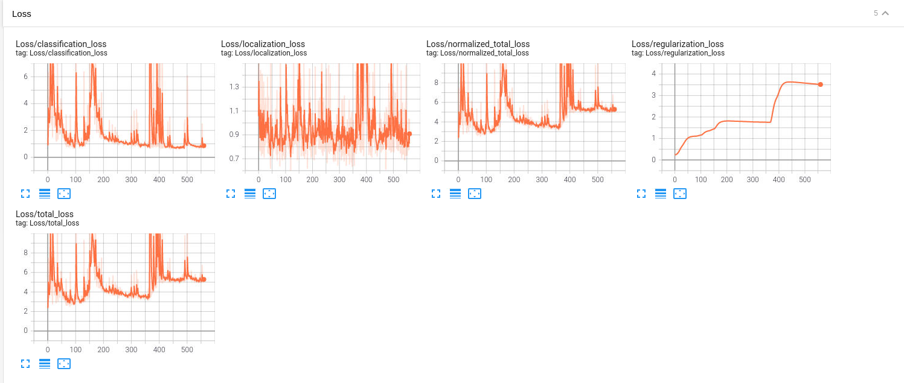
    
Classification loss and Localisation loss are almost similar to that of reference but regularization has improved but. Again the model seems to be saturating its learning.   

3. Experiment1: In this experiment, a RMS prop optimizer, with different learning rate curves has been tested. The above data augmentations are kept. As compared to momentum optimizer, RMS prop has better rate of convergence and also has a tendency to avoid being stuck around the local minima. Further, the learning rate of the optimizer is varied to observe the best response
    
    - The learning rate curve looks like  
    
    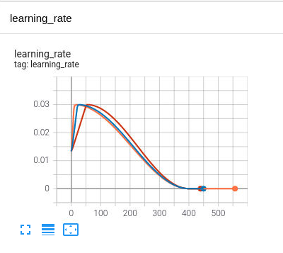

    - Following shows the results from training 
    
    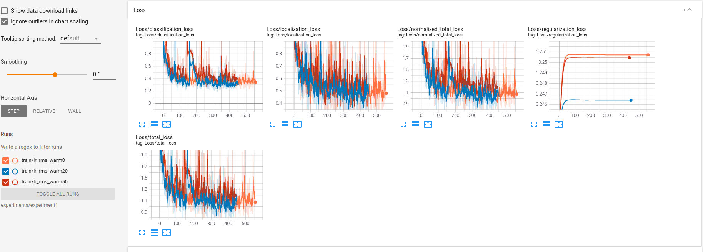
       
The learning rate curve shows a cosine decay after the different warmup values. After the learning rate decays to zero, the loss values is just the noisy because the model has stopped learning. These loss values have show more improvements as compared to reference and just DA. 
    
    
3. Experiment2: In this experiment, an ADAM optimizer, with different learning rate curves has been tested. The above data augmentations are kept. Adam optimizer has properties of both the momentum and rms optimizer combined and hence can show better results.   
    
    - The learning rate curve looks like  
    
    

    - Following shows the results from training 
    
    
       
Similar to previous experiment, the learning rate curve shows a cosine decay after the different warmup values. After the learning rate decays to zero, the loss values is just the noisy because the model has stopped learning. This experiment shows worst performance than rms prop but still better than reference. Running the evaluation script on the model results in the image below 

When compared to reference evaluation, experiment 2 results in similar output. However the difference lies in the regularization loss. This shows that rms prop and adam prop though have similar performance, they have optimal weights.
    
