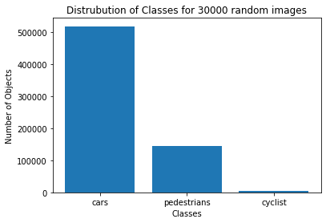
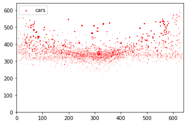
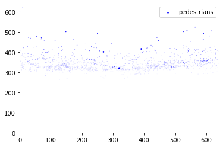
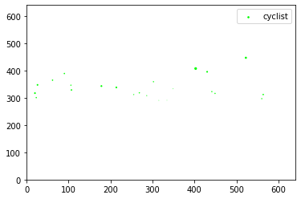

# Object Detection in an Urban Environment

Udacity Self Driving Car Engineer Nanodegree 
Author: Shreyansh Shethia

## Project overview:
Self driving cars need to sense the environment around them to navigate the chassis and necessarily avoid any unsafe situations. 
Object detection can help classify different objects in the surrounding and this information is then used track the motion of these objects. This project aims to analyse the real world image data from Waymo and create a CNN model to detect certain objects in those images. The real world dataset contains images from urban enviroments with ground truth for cars, pedestrians, and cyclists already labeled. 
Firstly an extensive data analysis (EDA) is performed including the computation of label distributions, display of sample images, and checking for object occlusions. Based on EDA, the favourable augmentations are performed. Then a general pretrained CNN model is trained on the given dataset to classify pedestrians, cyclists and cars in the images. Further, the hyperparameters of trained model are modified to achieve the better results.


## Set up: 
A brief description of the steps to follow to run the code for this repository are presented here. For further details on the structure of repository, downloading the dataset is presented here [README](https://github.com/udacity/nd013-c1-vision-starter/blob/main/README.md).

1. This project was ran on a virtual deskop where the dataset and other utility files were already downloaded and installed.
2. For Exploratory Data Analysis and Exploring Data Augmentation,
    - The jupyter notebook is launched in default browser using the command: 
    
        ```
        jupyter notebook --port 3002 --ip=0.0.0.0 --allow-root
        ```
        
    - Ran ` Exploratory Data Analysis.ipynb ` for exploring the Dataset, like displaying the image and looking the class distribution.
    - Ran `Explore augmentations.ipynb` for experimenting with different data augmentations in the protos file. All augmentations are taken from [`\experiments\proto_file_dataaugmentations.txt`](https://github.com/shreyshet/Project-1-Object-Detection-in-an-Urban-Environment/blob/main/experiments/proto_file_dataaugmentations.txt)  
3. For training a pretrained model on the dataset,
    - The pretrained model [SSD Resnet 50 640x640](http://download.tensorflow.org/models/object_detection/tf2/20200711/ssd_resnet50_v1_fpn_640x640_coco17_tpu-8.tar.gz) is downloaded and moved to <path to repo>/experiments/pretrained_model/
    - The following python script is used to edit the config files for training the model 
    
      ``` python edit_config.py --train_dir <path to repo>/data/train/ --eval_dir <path to repo>/data/val/ --batch_size 2 --checkpoint <path to repo>/experiments/pretrained_model/ssd_resnet50_v1_fpn_640x640_coco17_tpu-8/checkpoint/ckpt-0 --label_map  <path to repo>/experiments/label_map.pbtxt```
      
    - The `pipeline_new.config` is moved to `<path to repo>/experiments/reference` folder
    - In the repository directory, the model is trained using 
     
     ``` python experiments/model_main_tf2.py --model_dir=experiments/reference/ --pipeline_config_path=experiments/reference/pipeline_new.config ```
     
    - Parallely, the training is visualized using 
    
    ``` python -m tensorboard.main --logdir experiments/reference/ ```
    
    - The model is evaluated using 
    
    ``` python experiments/model_main_tf2.py --model_dir=experiments/reference/ --pipeline_config_path=experiments/reference/pipeline_new.config --checkpoint_dir=experiments/reference/ ```
    
4. For further improvements on the model, the pipeline_new.config is modified with Data Augmentations, different learning rayes and different optimizers. These modifications are organized as 
```
experiments/
    - pretrained_model/
    - exporter_main_v2.py - to create an inference model
    - model_main_tf2.py - to launch training
    - reference/ - reference training with the unchanged config file
    - experiment0/ - Experiment on different Data Augmentations (DA)
    - experiment1/ - Experiment on DA and RMS prop with different learning rates  
    - experiment2/ - Experiment on DA and ADAM optimizer with different learning rates
    - label_map.pbtxt - Text file describing labels 
    ...
```
  
    Each experiment is trained similar to step 3 but in different folders, changed the ```reference``` to ```experiment0/1/2``` and config files as given in this repository.
      
     

## Dataset
1. Dataset Analysis: This section contains a quantitative and qualitative description of the dataset using `Exploratory Data Analysis.ipynb` and `Explore augmentations.ipynb`.
    - A few images from dataset using `display_images()` from `Exploratory Data Analysis.ipynb`
    
             
        *Images from datasets with bounding boxes for each class: Car (red), Pedestrian (blue) and Bicycle (green)*
    
    - The total number of ground truth labels for each class is shown using the histogram below
             
        *Class distribution*
    
    - The location and size of bounding box distribution is also plotted for each class
    
        -      
        *Location and bounding box size distribution for Class = Car*
    
        -      
        *Location and bounding box size distribution for Class = Pedestrians*
        
        -      
        *Location and bounding box size distribution for Class = Bicycle*
    
2. Cross-validation: For cross validation the dataset was already split in the remote desktop in the ratio of 
        training: validation: test = 86: 10: 3   

## Training
1. Reference experiment: 
     - This uses the off-the-shelf pretrained model [SSD Resnet 50 640x640](https://arxiv.org/pdf/1512.02325.pdf). The modified config will changes in number of classes, batch Size, a few data augmentaions and hyperparameters for momentum optimzers.
     - the training from tensorboard is shwon below
    
    
    
     section should detail the results of the reference experiment. It should include training metrics, Tensorboard charts, and a detailed explanation of the algorithm's performance.
2. Improve on the reference: This section should highlight the different strategies you adopted to improve your model. It should contain relevant figures and details of your findings.


## Data

For this project, we will be using data from the [Waymo Open dataset](https://waymo.com/open/).

[OPTIONAL] - The files can be downloaded directly from the website as tar files or from the [Google Cloud Bucket](https://console.cloud.google.com/storage/browser/waymo_open_dataset_v_1_2_0_individual_files/) as individual tf records. We have already provided the data required to finish this project in the workspace, so you don't need to download it separately.

## Structure

### Data

The data you will use for training, validation and testing is organized as follow:
```
/home/workspace/data/waymo
    - training_and_validation - contains 97 files to train and validate your models
    - train: contain the train data (empty to start)
    - val: contain the val data (empty to start)
    - test - contains 3 files to test your model and create inference videos
```

The `training_and_validation` folder contains file that have been downsampled: we have selected one every 10 frames from 10 fps videos. The `testing` folder contains frames from the 10 fps video without downsampling.

You will split this `training_and_validation` data into `train`, and `val` sets by completing and executing the `create_splits.py` file.

### Experiments
The experiments folder will be organized as follow:
```
experiments/
    - pretrained_model/
    - exporter_main_v2.py - to create an inference model
    - model_main_tf2.py - to launch training
    - reference/ - reference training with the unchanged config file
    - experiment0/ - create a new folder for each experiment you run
    - experiment1/ - create a new folder for each experiment you run
    - experiment2/ - create a new folder for each experiment you run
    - label_map.pbtxt
    ...
```

### Exploratory Data Analysis

You should use the data already present in `/home/workspace/data/waymo` directory to explore the dataset! This is the most important task of any machine learning project. To do so, open the `Exploratory Data Analysis` notebook. In this notebook, your first task will be to implement a `display_instances` function to display images and annotations using `matplotlib`. This should be very similar to the function you created during the course. Once you are done, feel free to spend more time exploring the data and report your findings. Report anything relevant about the dataset in the writeup.

Keep in mind that you should refer to this analysis to create the different spits (training, testing and validation).


### Create the training - validation splits
In the class, we talked about cross-validation and the importance of creating meaningful training and validation splits. For this project, you will have to create your own training and validation sets using the files located in `/home/workspace/data/waymo`. The `split` function in the `create_splits.py` file does the following:
* create three subfolders: `/home/workspace/data/train/`, `/home/workspace/data/val/`, and `/home/workspace/data/test/`
* split the tf records files between these three folders by symbolically linking the files from `/home/workspace/data/waymo/` to `/home/workspace/data/train/`, `/home/workspace/data/val/`, and `/home/workspace/data/test/`

Use the following command to run the script once your function is implemented:
```
python create_splits.py --data-dir /home/workspace/data
```

### Edit the config file

Now you are ready for training. As we explain during the course, the Tf Object Detection API relies on **config files**. The config that we will use for this project is `pipeline.config`, which is the config for a SSD Resnet 50 640x640 model. You can learn more about the Single Shot Detector [here](https://arxiv.org/pdf/1512.02325.pdf).

First, let's download the [pretrained model](http://download.tensorflow.org/models/object_detection/tf2/20200711/ssd_resnet50_v1_fpn_640x640_coco17_tpu-8.tar.gz) and move it to `/home/workspace/experiments/pretrained_model/`.

We need to edit the config files to change the location of the training and validation files, as well as the location of the label_map file, pretrained weights. We also need to adjust the batch size. To do so, run the following:
```
python edit_config.py --train_dir /home/workspace/data/train/ --eval_dir /home/workspace/data/val/ --batch_size 2 --checkpoint /home/workspace/experiments/pretrained_model/ssd_resnet50_v1_fpn_640x640_coco17_tpu-8/checkpoint/ckpt-0 --label_map /home/workspace/experiments/label_map.pbtxt
```
A new config file has been created, `pipeline_new.config`.

### Training

You will now launch your very first experiment with the Tensorflow object detection API. Move the `pipeline_new.config` to the `/home/workspace/experiments/reference` folder. Now launch the training process:
* a training process:
```
python experiments/model_main_tf2.py --model_dir=experiments/reference/ --pipeline_config_path=experiments/reference/pipeline_new.config
```
Once the training is finished, launch the evaluation process:
* an evaluation process:
```
python experiments/model_main_tf2.py --model_dir=experiments/reference/ --pipeline_config_path=experiments/reference/pipeline_new.config --checkpoint_dir=experiments/reference/
```

**Note**: Both processes will display some Tensorflow warnings, which can be ignored. You may have to kill the evaluation script manually using
`CTRL+C`.

To monitor the training, you can launch a tensorboard instance by running `python -m tensorboard.main --logdir experiments/reference/`. You will report your findings in the writeup.

### Improve the performances

Most likely, this initial experiment did not yield optimal results. However, you can make multiple changes to the config file to improve this model. One obvious change consists in improving the data augmentation strategy. The [`preprocessor.proto`](https://github.com/tensorflow/models/blob/master/research/object_detection/protos/preprocessor.proto) file contains the different data augmentation method available in the Tf Object Detection API. To help you visualize these augmentations, we are providing a notebook: `Explore augmentations.ipynb`. Using this notebook, try different data augmentation combinations and select the one you think is optimal for our dataset. Justify your choices in the writeup.

Keep in mind that the following are also available:
* experiment with the optimizer: type of optimizer, learning rate, scheduler etc
* experiment with the architecture. The Tf Object Detection API [model zoo](https://github.com/tensorflow/models/blob/master/research/object_detection/g3doc/tf2_detection_zoo.md) offers many architectures. Keep in mind that the `pipeline.config` file is unique for each architecture and you will have to edit it.

**Important:** If you are working on the workspace, your storage is limited. You may to delete the checkpoints files after each experiment. You should however keep the `tf.events` files located in the `train` and `eval` folder of your experiments. You can also keep the `saved_model` folder to create your videos.


### Creating an animation
#### Export the trained model
Modify the arguments of the following function to adjust it to your models:

```
python experiments/exporter_main_v2.py --input_type image_tensor --pipeline_config_path experiments/reference/pipeline_new.config --trained_checkpoint_dir experiments/reference/ --output_directory experiments/reference/exported/
```

This should create a new folder `experiments/reference/exported/saved_model`. You can read more about the Tensorflow SavedModel format [here](https://www.tensorflow.org/guide/saved_model).

Finally, you can create a video of your model's inferences for any tf record file. To do so, run the following command (modify it to your files):
```
python inference_video.py --labelmap_path label_map.pbtxt --model_path experiments/reference/exported/saved_model --tf_record_path /data/waymo/testing/segment-12200383401366682847_2552_140_2572_140_with_camera_labels.tfrecord --config_path experiments/reference/pipeline_new.config --output_path animation.gif
```

## Submission Template

### Project overview
This section should contain a brief description of the project and what we are trying to achieve. Why is object detection such an important component of self driving car systems?

### Set up
This section should contain a brief description of the steps to follow to run the code for this repository.

### Dataset
#### Dataset analysis
This section should contain a quantitative and qualitative description of the dataset. It should include images, charts and other visualizations.
#### Cross validation
This section should detail the cross validation strategy and justify your approach.

### Training
#### Reference experiment
This section should detail the results of the reference experiment. It should includes training metrics and a detailed explanation of the algorithm's performances.

#### Improve on the reference
This section should highlight the different strategies you adopted to improve your model. It should contain relevant figures and details of your findings.
